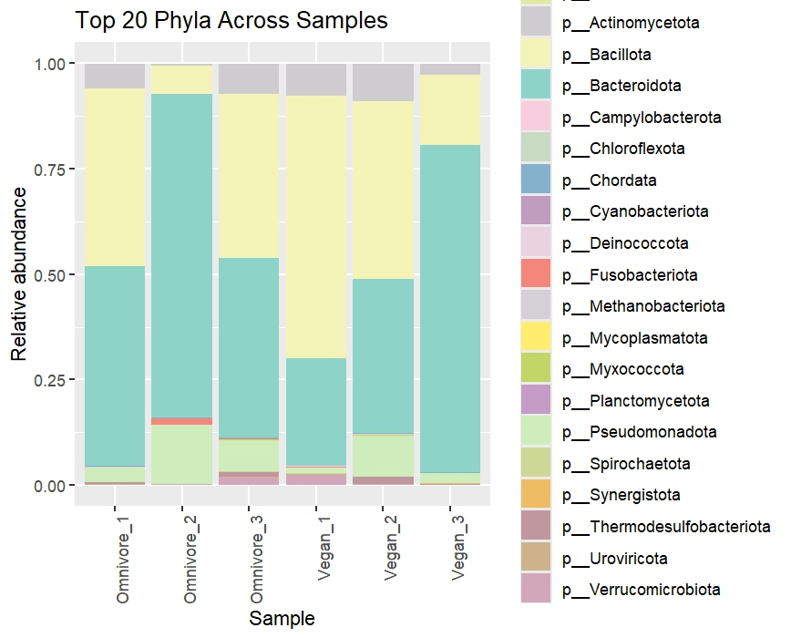
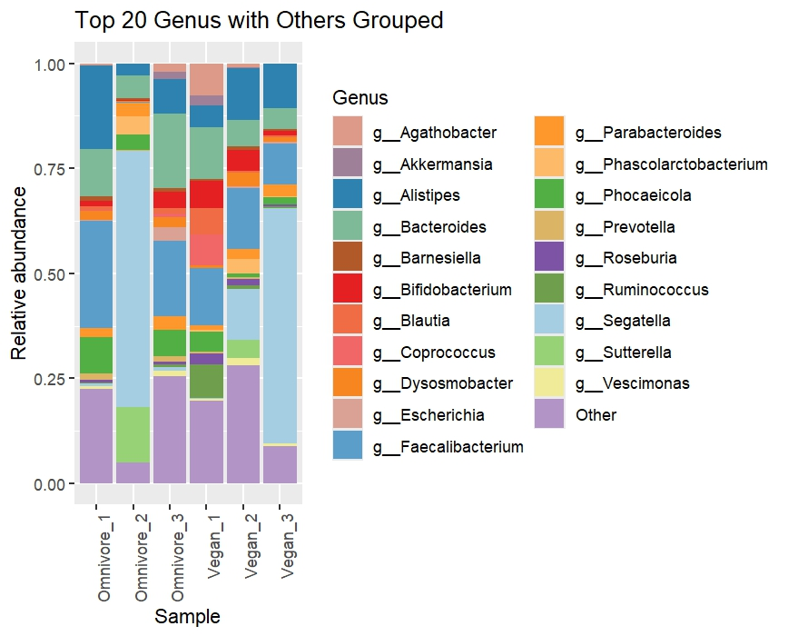
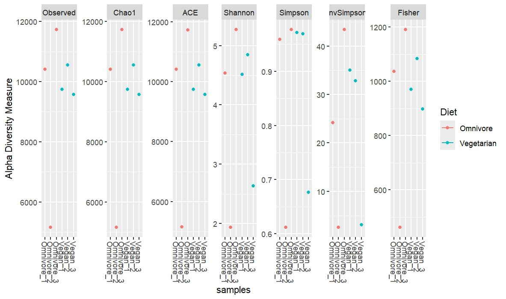
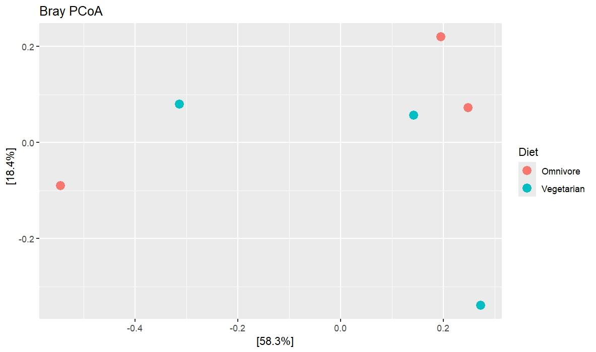
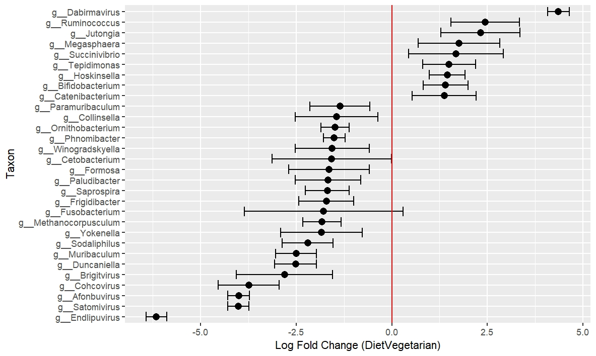

# Comparative Taxonomic Profiling of the Human Gut Microbiome in Herbivorous and Omnivorous Diets
Metagenomics is the study of genetic material recovered directly from environmental samples such as soil, water, or the human gut without the need to culture individual species in the laboratory (Kushwaha et al., 2022). In this context, it enables the taxonomic classification of microbial communities present within a given environment.

The aim of this project is to evaluate appropriate methods, software tools, and parameter settings for shotgun metagenomic analysis, and to apply these approaches to human gut microbiome data in order to perform comparative taxonomic profiling between herbivorous and omnivorous diets.

Studying the gut microbiome is essential for understanding the composition of microbial communities within the human gut, including bacteria, fungi, and viruses that influence host health, immune regulation, and nutrient metabolism. Alterations in this taxonomic composition which are often referred to as dysbiosis have been associated with a range of diseases and may serve as potential biomarkers for diagnosis and disease monitoring (Hou et al., 2022).

Furthermore, characterizing the microbial composition of a healthy gut can aid in identifying protective communities that resist pathogenic colonization, as well as detecting the emergence of potentially harmful microorganisms. Beyond composition, such analyses also provide insight into microbial function. In this study, a taxonomic approach is used to investigate differential abundance of gut microorganisms in relation to dietary patterns, specifically comparing herbivorous and omnivorous diets (Meeks et al., 2022).

In order to properly study gut microbiome taxonomy across different diets  using shotgun metagenomics, we must use appropriate and effective tools and software for the data provided to achieve accurate results.

## Method Comparison
Kraken2 is a preferred classification tool due to a number of factors. Firstly, when compared to other classification tools like Kraken1 and CLARK, it is considerably faster and also shows an 85% improvement in memory usage in comparison to Kraken1. In comparison to KrakenUniq, its databases can be built faster, and there is extensive availability of reliable prebuilt databases, while still maintaining a comparable false positive rate to KrakenUniq. For a general overview to understand the overall taxonomic structure without a focus on novel organisms, Kraken2 is optimal (Wood et al., 2019).

The Kraken2 standard database is a good choice for an overview analysis, as it has higher classification rates than the MiniKraken and standard-16 databases and uses less storage space than the core nt database, giving it a good balance between accuracy and storage optimization (Liu et al., 2024).

Re-estimation of abundances using Bracken is standard for pipelines using Kraken2, as it overcomes the limitations of Kraken2, which sometimes overestimates abundances (Lu et al., 2016).

ANCOM-BC2 (Analysis of Compositions of Microbiomes with Bias Correction 2) is preferred for this analysis due to its ability to handle the complex challenges of microbiome data and its superior ability to control the false discovery rate in differential abundance analysis when compared to other methods like LOCOM and LinDA (Lin & Peddada, 2023).

# Methods

## Data Acquisition

The dataset used for this analysis was obtained from the NCBI database under BioProject accession SRP126540. It consisted of six samples in SRA file format with files each for both diet types(Vegan and Omnivore diets). SRR files were converted to FASTQ files using SRA Toolkit Release 3.3.0 (The Sequence Read Archive (SRA), n.d.). The prebuilt database(standard) for kraken2 was downloaded from the github page maintained by the creators of the software. 

`-- split files` : ensures fileswith paired reads  get properly read

`-- threads `: was used to specify the number of cores to use while running the program

`--temp` : was used to specify the temporary location to write files to in order to maintain memory usage

## Quality Control

Quality control checks were performed using FastQC v0.12.1 for each individual FASTQ file and were viewed collectively using MultiQC v1.33 (Babraham Bioinformatics - FastQC A Quality Control Tool for High Throughput Sequence Data, n.d.; Ewels et al., 2016).

## Classification
Classification was performed using Kraken2 v2.1.6 with the Kraken2 standard database (Wood et al., 2019). The following parameters were used:

`--db`: to specify the database

`--paired`: to specify paired reads

`--report`: to generate a report file with taxonomic abundances

## Re-estimation
Re-estimation was performed using Bracken v3.0 with the same Kraken2 database and default options to produce a species-level report (Lu et al., 2017).

## Relative abundance
The data were imported into R v4.5.1 using the biomformat package v1.36.0, and Phyloseq v1.52.0 was used to calculate the relative abundance of the respective taxa of interest using the `transform_sample_counts` function and standard R functions for division (McDonald et al., 2012; McMurdie & Holmes, 2013).

## Diversity measures
Alpha diversity plots were generated using the `plot_richness` function from the Phyloseq v1.52.0 package, while beta diversity plots were generated using the ordinate function from the same package. The distance metric chosen was Bray–Curtis to account for differential abundance rather than just presence/absence (McMurdie & Holmes, 2013).

## Differential abundance
Singletons were removed prior to differential abundance analysis, and the data were subsetted to the top 1000 most abundant genera. Differential abundance was calculated using ANCOM-BC2 v2.10.1. The fixed formula and structural zero variable were set to the diet variable, while `lib_cut` was set to 1000 to remove samples with low sequencing depth. Other default parameters were retained to preserve the accuracy of the method (Lin & Peddada, 2023).

# Results 
## Quality Assessment
Quality assessment of raw sequencing reads was performed using FastQC and summarized with MultiQC. Per-base sequence quality scores across all samples were consistently high, with the majority of bases exhibiting Phred quality scores above 30. Per-sequence quality score distributions were tightly clustered, with the majority of reads falling within high-confidence score ranges. Per-base N content was negligible across all samples. The proportion of ambiguous nucleotides (N) remained near zero across read positions, without position-specific spikes. There were little to no overrepresented sequences and adapted content detected by FastQC. Collectively, these quality metrics demonstrate that the sequencing data are of high technical quality and suitable for taxonomic profiling and other downstream  analysis without extensive quality trimming. 
Reports can be seen at [QC reports](https://iroayotoki2.github.io/Metagenomics/)

## Relative Abundance 
Relative abundance plots made at both the phylum and genus level reveal important information about the samples, at the phylum level all the samples consisted largely of 4 main phyla (acidobacteriota, acinomycetota, bacteroidota and bacillota) while at the genus level at least 75% of each sample consisted of a random distribution of about 20 samples while the other 25% was contained the other genera that were not observed in these plots. There is no visible diet based distribution found from this analysis step this is possibly due to small sample size.

Figure 1: Top 20 Phylum-Level Relative Abundance Across Samples
Stacked bar plot illustrating the relative abundance of the top 20 phyla across all samples. Each bar corresponds to an individual sample grouped by diet (Omnivore vs. Vegan). The plot reveals overall taxonomic structure at a higher classification level, showing dominant phyla shared across samples as well as variation in their relative proportions between dietary groups

Figure 2: Top 20 Genus-Level Relative Abundance Across Samples
Stacked bar plot showing the relative abundance of the top 20 most abundant genera across all samples, with remaining genera grouped as “Other.” Each bar represents an individual sample categorized by diet (Omnivore vs. Vegan). Differences in genus composition highlight variability both within and between dietary groups, with certain genera showing higher relative abundance in specific diets.

## Alpha Diversity 
Alpha diversity analysis revealed differences in richness and evenness between diet groups. Richness-based metrics, including Observed features, Chao1, ACE, and Fisher indices, were generally higher in omnivore samples compared to vegetarian samples, suggesting increased taxonomic richness in the omnivore group. However, substantial variability was observed among omnivore replicates, including one notably low-richness sample. In contrast, vegetarian samples displayed more consistent richness estimates. Shannon diversity values were comparable between the two groups, indicating that overall diversity, accounting for both richness and evenness, did not differ markedly. However, Simpson and inverse Simpson indices highlighted reduced evenness in at least one omnivore sample, consistent with dominance by a few taxa, whereas vegetarian samples exhibited more uniform community structure. Overall, these results suggest that while omnivore-associated communities may harbor greater richness, vegetarian-associated communities appear more even and less variable across samples.

Figure 3:  Alpha diversity across omnivore and vegetarian samples using multiple metrics (Observed, Chao1, ACE, Shannon, Simpson, inverse Simpson, Fisher). Omnivore samples generally show higher richness but greater variability, including a low-richness outlier, while vegetarian samples display more consistent diversity. Shannon values are similar between groups, whereas Simpson-based indices indicate more even community structure in vegetarian samples.

## Beta Diversity 
Beta diversity using Bray Curtis dissimilarity measures compositional dissimilarity based on abundances. The principal coordinate analysis(PCoA) showed the first PC to explain 58% of the variance while the second explained 18% of the variance, however upon plotting these did not form any visible clusters across the samples by diet. aThis could be attribbuted to the small sample size used for this analysis. The PERMANOVA analysis also showed significant correlation across the diet with a p-value of 0.8

Figure 4: Beta diversity across omnivore and vegetarian samples using Bray-Curtis dissimilarity with the first principal coordinate explaining 58% of the variation and the second explaining 18%  of the variation.

## Differential Abundance 
Differential abundance analysis, performed using the vegetarian group as the reference, identified no taxa that were significantly different between diets (p < 0.05). However, structural zero analysis revealed three genera that were present in the omnivore group but absent in the vegetarian group (g__Junduvirus, g__Aurodevirus, and g__Buchavirus). To further explore potential trends, taxa with the highest absolute log fold changes were visualized, highlighting the largest differences in abundance despite the lack of statistical significance.

| taxon           | structural_zero (Diet_S0 = Omnivore) | structural_zero (Diet_S0 = Vegetarian) |
|-----------------|--------------------------------------|----------------------------------------|
| g__Junduvirus   | FALSE                                | TRUE                                   |
| g__Aurodevirus  | FALSE                                | TRUE                                   |
| g__Buchavirus   | FALSE                                | TRUE                                   |

Figure 5: Log fold changes of differentially abundant taxa across diet groups. Each point represents a taxon, with positive values indicating higher abundance in the comparison group(Omnivore) relative to the reference(Vegetarian) , and negative values indicating lower abundance. 

# Discussion
The results largely show little to no association between diet type and gut microbiome composition, apart from the alpha diversity measure, which indicated increased diversity in the omnivorous samples. This is likely due to the small sample size used in this analysis, making it difficult to draw robust statistical conclusions and representing a major limitation of this study.

The increased diversity observed in the omnivorous group is notable, as higher microbial diversity is often associated with vegetarian diets due to their high fiber content, according to a cross-sectional study by Losasso et al. (2018). This unexpected finding warrants further investigation and may connect with other observations described below.

Two taxa found exclusively in the omnivorous group—Aurodevirus and Buchavirus—are bacteriophages belonging to the order Crassvirales. These findings align with previous studies showing that members of the Crassvirales order are strongly associated with high-fat, Western-style omnivorous diets. Their presence could also contribute to the higher microbial diversity observed in the omnivore group, as these bacteriophages are more likely to thrive in a bacteria-rich environment (Cao et al., 2022).

Succinvibrio, a bacterium associated with the breakdown of complex carbohydrates, was more abundant in the vegetarian samples. This observation is consistent with the metabolic requirements of a plant-based diet, as several studies report higher levels of beneficial polysaccharide fermentation products in vegans. This supports the enrichment of microbes specialized in carbohydrate breakdown in the vegetarian gut microbiome (Saxena et al., 2016; Sidhu et al., 2023).

# Conclusion

Overall, this analysis suggests that diet type may influence specific microbial taxa and functional groups, but larger sample sizes are needed to detect broader, statistically significant differences in gut microbiome composition. The presence of Crassvirales bacteriophages in omnivores and carbohydrate-metabolizing bacteria in vegetarians highlights the potential link between diet and microbial ecology. Future studies should explore these associations in larger cohorts to clarify how dietary patterns shape gut microbial diversity and function.

# References
Babraham Bioinformatics - FastQC A Quality Control tool for High Throughput Sequence Data. (n.d.). Retrieved March 1, 2026, from https://www.bioinformatics.babraham.ac.uk/projects/fastqc/

Cao, Z., Sugimura, N., Burgermeister, E., Ebert, M. P., Zuo, T., & Lan, P. (2022). The gut virome: A new microbiome component in health and disease. EBioMedicine, 81, 104113. https://doi.org/10.1016/j.ebiom.2022.104113

Ewels, P., Magnusson, M., Lundin, S., & Käller, M. (2016). MultiQC: summarize analysis results for multiple tools and samples in a single report. Bioinformatics, 32(19), 3047–3048. https://doi.org/10.1093/bioinformatics/btw354

Hou, K., Wu, Z. X., Chen, X. Y., Wang, J. Q., Zhang, D., Xiao, C., Zhu, D., Koya, J. B., Wei, L., Li, J., & Chen, Z. S. (2022). Microbiota in health and diseases. Signal Transduction and Targeted Therapy 2022 7:1, 7(1), 135-. https://doi.org/10.1038/s41392-022-00974-4

Kushwaha, U. K. S., Adhikari, N. R., Prasad, B., Maurya, S. K., Thangadurai, D., & Sangeetha, J. (2022). Genomics and its role in crop improvement. Bioinformatics in Agriculture: Next Generation Sequencing Era, 61–77. https://doi.org/10.1016/B978-0-323-89778-5.00024-6

Lin, H., & Peddada, S. Das. (2023). Multi-group Analysis of Compositions of Microbiomes with Covariate Adjustments and Repeated Measures. Research Square, rs.3.rs-2778207. https://doi.org/10.21203/rs.3.rs-2778207/v1

Liu, Y., Ghaffari, M. H., Ma, T., & Tu, Y. (2024). Impact of database choice and confidence score on the performance of taxonomic classification using Kraken2. ABIOTECH, 5(4), 465–475. https://doi.org/10.1007/s42994-024-00178-0

Losasso, C., Eckert, E. M., Mastrorilli, E., Villiger, J., Mancin, M., Patuzzi, I., Di Cesare, A., Cibin, V., Barrucci, F., Pernthaler, J., Corno, G., & Ricci, A. (2018). Assessing the influence of vegan, vegetarian and omnivore oriented westernized dietary styles on human gut microbiota: A cross sectional study. Frontiers in Microbiology, 9(MAR), 317. https://doi.org/10.3389/fmicb.2018.00317

Lu, J., Breitwieser, F. P., Thielen, P., & Salzberg, S. L. (2016). Bracken: Estimating species abundance in metagenomics data. https://doi.org/10.1101/051813

Lu, J., Breitwieser, F. P., Thielen, P., & Salzberg, S. L. (2017). Bracken: Estimating species abundance in metagenomics data. PeerJ Computer Science, 2017(1), e104. https://doi.org/10.7717/peerj-cs.104

McDonald, D., Clemente, J. C., Kuczynski, J., Rideout, J. R., Stombaugh, J., Wendel, D., Wilke, A., Huse, S., Hufnagle, J., Meyer, F., Knight, R., & Caporaso, J. G. (2012). The Biological Observation Matrix (BIOM) format or: how I learned to stop worrying and love the ome-ome. GigaScience 12 1:1, 1(1), 7-. https://doi.org/10.1186/2047-217X-1-7

McMurdie, P. J., & Holmes, S. (2013). phyloseq: An R Package for Reproducible Interactive Analysis and Graphics of Microbiome Census Data. PLOS ONE, 8(4), e61217. https://doi.org/10.1371/journal.pone.0061217

Meeks, B. K., Maki, K. A., Ames, N. J., & Barb, J. J. (2022). Comparing Published Gut Microbiome Taxonomic Data Across Multinational Studies. Nursing Research, 71(1), 43. https://doi.org/10.1097/NNR.0000000000000557

Saxena, R. K., Saran, S., Isar, J., & Kaushik, R. (2016). Production and Applications of Succinic Acid. Current Developments in Biotechnology and Bioengineering: Production, Isolation and Purification of Industrial Products, 601–630. https://doi.org/10.1016/B978-0-444-63662-1.00027-0

Sidhu, S. R. K., Kok, C. W., Kunasegaran, T., & Ramadas, A. (2023). Effect of Plant-Based Diets on Gut Microbiota: A Systematic Review of Interventional Studies. Nutrients, 15(6), 1510. https://doi.org/10.3390/nu15061510

The Sequence Read Archive (SRA). (n.d.). Retrieved March 1, 2026, from https://www.ncbi.nlm.nih.gov/sra/docs/

Wood, D. E., Lu, J., & Langmead, B. (2019). Improved metagenomic analysis with Kraken 2. Genome Biology 2019 20:1, 20(1), 257-. https://doi.org/10.1186/s13059-019-1891-0

Zhou, Q., Su, X., & Ning, K. (2014). Assessment of quality control approaches for metagenomic data analysis. Scientific Reports 2014 4:1, 4(1), 6957-. https://doi.org/10.1038/srep06957
